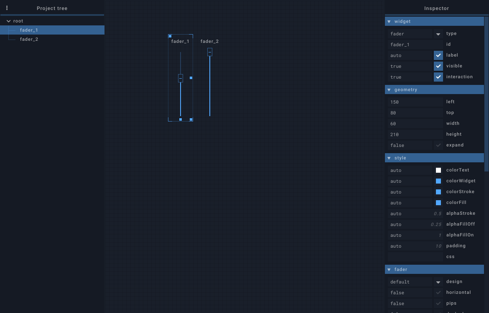

!!! warning "Incomplete documentation"

## Widget selection

Clicking on a widget, on a tab label or on an item in the project tree selects the widgets for edition:

- All its editable properties are shown in the inspector panel
- The corresponding item in the project tree is highlighted
- A selection outline is drawn around the widget
- Dragging / Resizing handles are added to the widget

## Menu

Right clicking on a widget displays a menu with the following actions

- `Show in tree`: show widget in project tree (hidden when clicking in the project tree)
- `Copy`: copy widget's data
- `Cut`: copy widget's data and delete selected widget
- `Paste`: paste copied widget in selected container
    - `Paste`: paste the widget as is
    - `ID + 1` : increments the id of the copied widget (and all its children) before pasting
    - `Clone` : create a clone widget targetting the copied widget
- `Add widget`: create a new widget in selected container
- `Add tab`: create a new tab in selected container
- `Delete`: delete selected tab or widget

## Inspector

Selected widget's properties are displayed and can be modified in the inspector. The [properties reference](../widgets/properties-reference.md) lists the available properties for each widget type.

- Property fields are all multiline (press `shift + enter` for new line).
- Properties are written in JSON, with some flexibility brought by the [JSON5](https://github.com/json5/json5) format. For example, doubles quotes around object keys are not mandatory.

## Project tree

The project tree displays the whole widget structure of the session. Widgets can be reordered within a container with drag-and-drop.

## Widget resizing / dragging

Selected widget can be resized using its south, south-east and east handles. It can be dragged with its north-west handle. If the widget's position/size was written in percents, the editor will try to keep using percents.

When the grid is enabled, widget resizing / dragging snaps to a 10 pixel wide grid.

## Multi-widgets editing

Multiple widgets can be edited at once.

- The inspector will only display properties that are shared by all selected widgets
- Selection can only contain sibling widgets (same direct parent)
- Context-menu actions and properties changes apply to all selected widgets
- Resizing / Dragging will affect all selected widgets, relatively the selection's size and position

## Keyboard shortcuts

The following shortcuts are available only when the editor is enabled:

| Shortcut | Description |
|---|---|
| `click` | Widget selection. |
| `mod + click` | Multi-widget selection. Widgets can be toggled from selection by clicking on them individually.|
| `shift + click + drag`* | Draw a selection rectangle and attempt to select widgets in it (starts by selecting the widget under the cursor). If `mod` is pressed too, current selection is kept and will be merged with the new one if possible. |
| `mod + z` | Undo |
| `mod + y / mod + shift + z` | Redo |
| `delete` (`backspace` on Mac) | Delete selected widgets |
| `mod + c` | Copy selected widgets |
| `mod + x` | Cut selected widgets |
| `mod + v` | Paste clipboard in selected widget |
| `mod + shift + v` | Paste and increment id |
| `up, down, left, right` | Move selected widgets (1 grid unit, hold `shift` for 5 grid units) |
| `alt + [up, down, left, right]` | Resize selected widgets (1 grid unit, hold `shift` for 5 grid units) |
| `mod + a` | Select current widget's siblings and itself |
| `mod + shift + a` | Cancel current widget selection |
| `mod + up` | Select current widget's parent |
| `mod + down` | Select current widget's first child |
| `mod + right` | Select current widget's next sibling |
| `mod + left` | Select current widget's previous sibling |

!!! info ""
    `mod` refers to the `ctrl` key except on MacOs (`command`)
